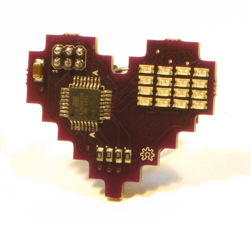

[8bitheart](https://meowcad.com/project?projectId=1bd24ce3-91d9-4846-b30d-1a8cfacd72d0)
===



<a href="http://www.youtube.com/watch?feature=player_embedded&v=0BI4rqI0vt0" target="_blank"></a>

```bash
$ make
$ sudo ./program_avr.sh 8bitheart.hex
```
